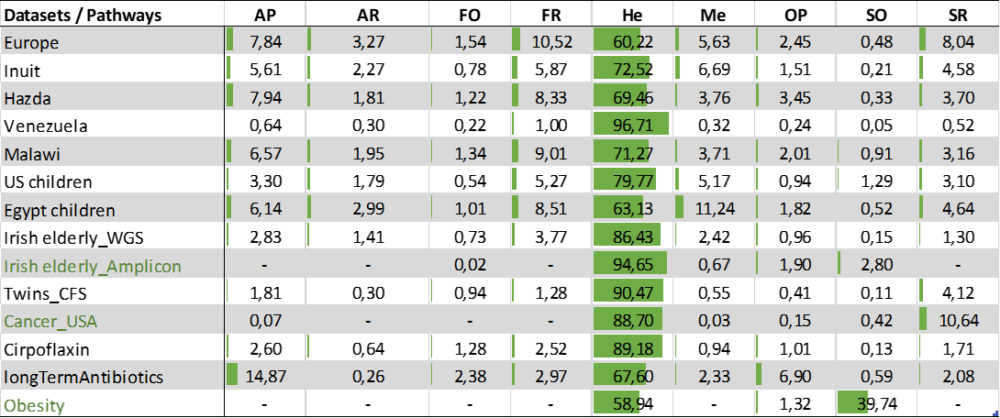
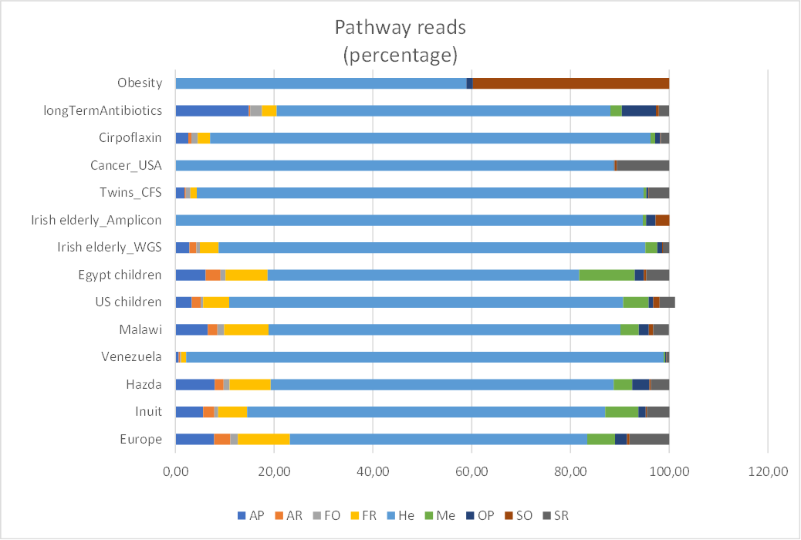
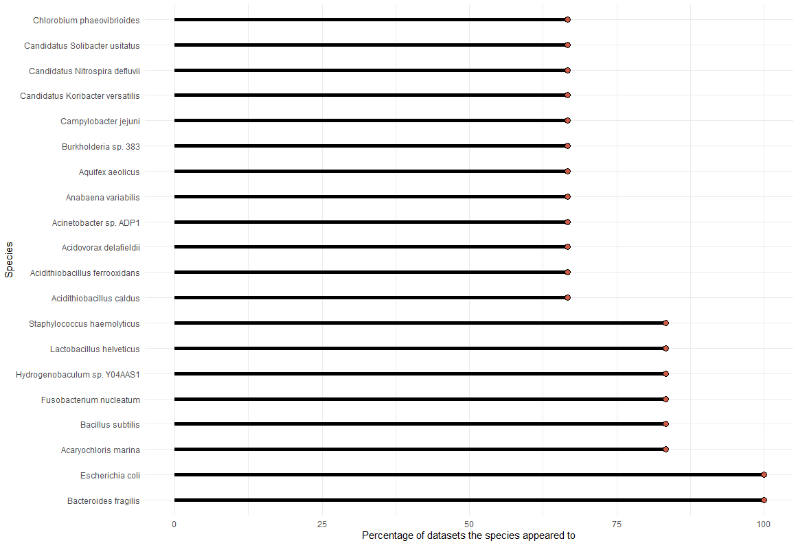
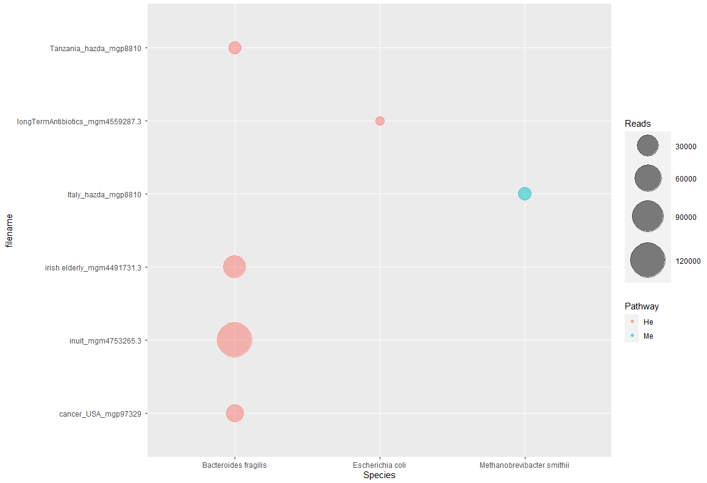

# Bioenergetic-pathways-human-gut

# Overview
This is a data analysis and visualization project created for studying the bioenergetic pathways in the human gut microbiome. The goal of the analysis was to extract insights about the bioenergetic differences between individuals that live in distinct environments and cultural settings, as well as individuals with different health issues. Data originated from the MG-Rast database.

# Background
In recent years, the human gut microbiome's role in the overall health of the individual has been closely studied with interesting insights arising about its role. Specific microbiome profiles have been linked with either diseases or good health. An aspect of this field that has not been studyied in detail involves the analysis of the bioenergetic pathways of the gut microbiome. These pathways involve the transformation of energy from procaryotes through an ensemble of chemical reactions performed by them (eg photosynthesis). The study by Koumandou et. al. (https://www.sciencedirect.com/science/article/pii/S2214540017300993#t0005), provided a list of linked bacteria species to bioenergetic pathways and it was used as a the link between the bacteria found in the studies explored in this analysis and their respective pathways. The pathways explored were the following:

* Anoxygenic photosynthesis (AP)
* Arsenate reduction (AR)
* Iron oxidation (FO)
* Iron reduction (FR)
* Heterotrophs (He)
* Methanogenesis (Me)
* Oxygenic photosynthesis (OP)
* Sulfur oxidation (SO)
* Sulfate reduction (SR)

# Data
All data originated from the MG-Rast database. The metagenomic data were derived from either Whole Genome Sequencing (WGS) or Amplicon-based sequencing. The analyzed datasets are presented in the following figure. They were of three loosely distinct categories. The first category included datasets of healthy individuals of the "Western" culture (eg Americans). The second category included datasets of healthy individuals of completely different environment or culture (eg Hazda populations) and the third one included datasets of individuals with some health issue (eg cancer or prolonged use of antibiotics).

  
   
  <em>Figure 1. Datasets used in the analysis.</em>

# Pipeline
This work was an extension of a previously established pipeline that assigned to each bacteria species presented in each dataset the bioenergetic pathways to which this species normally contributes. Utilizing the results of that pipeline, Microsoft Excel and R were used to visualize and explore the pathways and species prevalence in each dataset.

# Results

## Bioenergetic pathways' prevalence in each dataset
The following figures depict the prevalence of each pathway in the analyzed datasets. The prevalent pathway in all of the studied datasets was the He pathway. The more sequencing reads or samples a dataset had, the more a decrease in the He pathway and an enrichment of the others began to appear (Europe, Inuit, Malawi, Egypt_children, US_children longTermAntibiotics, Obesity). Perhaps it is of significance the fact that in the Hazda dataset those changes had already begun to appear under a smaller number of seq reads. There also appeared to be a pattern in all gut microbiome pathways under which they shared similar enrichment, with most differences appearing between healthy and unhealthy individuals. Unhealthy individuals appeared to have slightly less enrichment in the AR, FR and Me pathways. Furthermore, the Cancer dataset had the strongest presence of the SR pathway, while Obesity dataset had the strongest presence of the SO pathway, while it appears that prolonged use of antibiotics enriches the AP pathway (and perhaps the OP pathway as well).

  
   
  <em>Figure 2. Bioenergetic pathways prevalence in each dataset.</em>

  
   
  <em>Figure 3. Bioenergetic pathways prevalence in each dataset (another visualization).</em>

## Common appearences of bacteria species between the datasets
The appearence of prevalent bacteria species was also explored, as seen in the following figure where 20 of the most common species between the datasets appear, in regards to the percentage of datasets they appear to. 

  
   
  <em>Figure 4. Appearence of prevalent bacteria species across the datasets.</em>

## Magnitude of appearence of bacteria species
The number of times a bacteria species appeared in each dataset was also explored for some of the most common species or those that are known to be linked with specific diseases. An example can be seen in the following figure.

  
   
  <em>Figure 5. Magnitude of appearence of bacteria species and their respective bioenergetic pathways.</em>

# Future work 
The current study explored a small number of datasets that were provided in the database. Future research could involve the exploration of more datasets. More datasets of unhealthy individuals could also be used to explore any bioenergetic differences occuring in comparison to healthy individuals. Finally, it would be beneficial to explore datasets of individuals bearing gut-specific diseases (eg IBD) where the bioenergetic differences would likely be more pronounced and thus offer insights of greater significance.