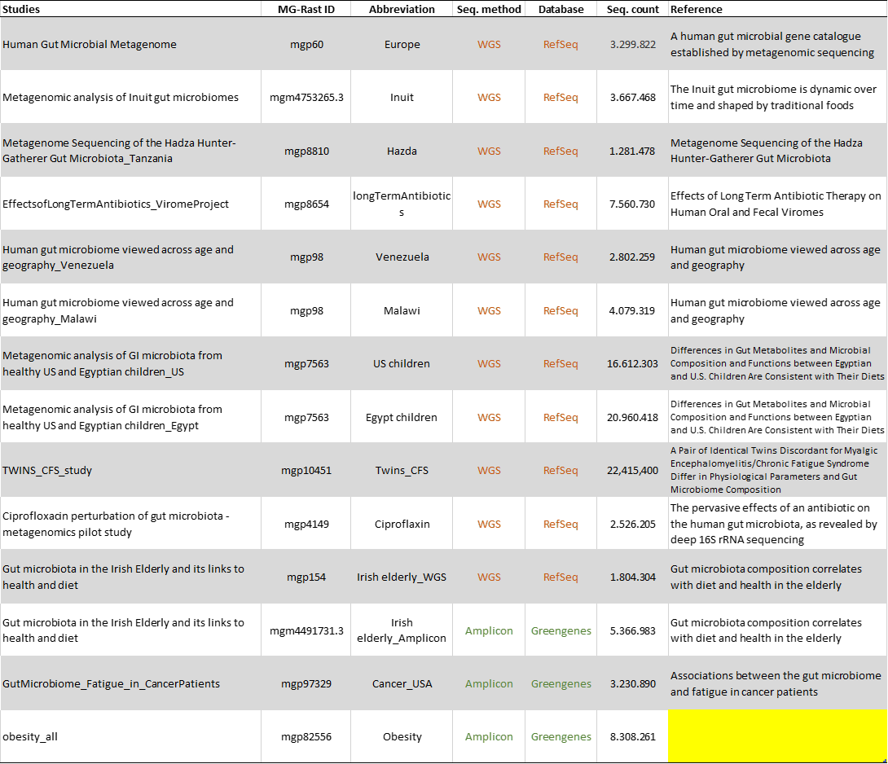

# Bioenergetic-pathways-human-gut

# Overview
This is a data analysis and visualization project created for studying the bioenergetic pathways in the human gut microbiome. The goal of the analysis was to extract insights about the bioenergetic differences between individuals that live in distinct environments and cultural settings, as well as individuals with different health issues. Data originated from the MG-Rast database.

# Background
In recent years, the human gut microbiome's role in the overall health of the individual has been closely studied with interesting insights arising about its role. Specific microbiome profiles have been linked with either diseases or good health. An aspect of this field that has not been studyied in detail involves the analysis of the bioenergetic pathways of the gut microbiome. These pathways involve the transformation of energy from procaryotes through an ensemble of chemical reactions performed by them (eg photosynthesis). The study by Koumandou et. al. (https://www.sciencedirect.com/science/article/pii/S2214540017300993#t0005), provided a list of linked bacteria species to bioenergetic pathways and it was used as a the link between the bacteria found in the studies explored in this analysis and their respective pathways. The pathways explored were the following:

* Anoxygenic photosynthesis (AP)
* Arsenate reduction (AR)
* Iron oxidation (FO)
* Iron reduction (FR)
* Heterotrophs (He)
* Methanogenesis (Me)
* Oxygenic photosynthesis (OP)
* Sulfur oxidation (SO)
* Sulfate reduction (SR)

# Data
All data originated from the MG-Rast database. The metagenomic data were derived from either Whole Genome Sequencing (WGS) or Amplicon-based sequencing. The analyzed datasets are presented in the following figure. 

<figure>
  

    
  

  <figcaption style="text-align: center; font-style: italic;">Figure 1. Datasets used in the analysis.</figcaption>
</figure>

